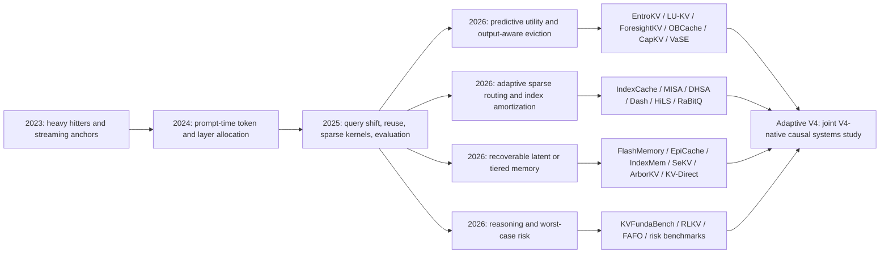

# Adaptive V4 Memory paper map

Snapshot: 2026-07-17 (Asia/Seoul)

This map covers long-context text-LLM memory mechanisms that can invalidate,
constrain, or sharpen Adaptive V4 Memory. It uses the official
[ICML 2026 paper list](https://icml.cc/Downloads/2026) as the venue anchor and
then adds recent arXiv work. An ICML link means an accepted ICML 2026 paper;
an arXiv link alone means that no venue claim is made here.

The map is intentionally organized by **action and decision time**, not by the
authors' use of the word “compression.” Token deletion, sparse reading, cold
residency, reconstruction, and precision reduction do not have the same
failure modes or physical costs.

## Scope and evidence status

The discovery pass searched the official ICML list by `KV`, `cache`, `sparse
attention`, `long-context`, `memory`, `recompute`, and `reasoning`, then searched
2026 arXiv metadata for the same concepts and followed direct citation
neighbors. The inclusion rule is a text-LLM mechanism that changes memory
admission, retention, reading, representation, placement, reuse, or evaluation.
Video-only and generic context-compression work is excluded unless its mechanism
directly transfers to a text-LLM cache.

This is a reproducible **field map and claim-threat triage**, not yet a completed
systematic review. Quantitative statements below are restricted to official
abstracts or primary arXiv pages. Papers in the immediate reading queue still
require full-text extraction of experimental setup, code/runtime contracts,
negative results, and baseline fairness before they become executable
comparators or citation-ready evidence in a paper draft.

## 1. Coordinate system

| Lifecycle action | Question | 2023–2025 roots | 2026 frontier | Adaptive V4 consequence |
| --- | --- | --- | --- | --- |
| admission / write | Which state enters durable memory? | [FastGen](https://arxiv.org/abs/2310.01801), [KV Admission](https://arxiv.org/abs/2512.17452) | [SP-KV](https://arxiv.org/abs/2605.14037) | A learned write gate is a comparator, but irreversible omission is not equivalent to cold residency |
| retention / eviction | Which existing entries remain in a bounded cache? | [H2O](https://arxiv.org/abs/2306.14048), [SnapKV](https://arxiv.org/abs/2404.14469), [PyramidKV](https://arxiv.org/abs/2406.02069), [Ada-KV](https://arxiv.org/abs/2407.11550) | [EntroKV](https://icml.cc/virtual/2026/poster/60679), [ForesightKV](https://arxiv.org/abs/2602.03203), [LU-KV](https://icml.cc/virtual/2026/poster/65241), [OBCache](https://icml.cc/virtual/2026/poster/62607), [CapKV](https://icml.cc/virtual/2026/poster/66558), [VaSE](https://arxiv.org/abs/2606.03928) | Entropy, future utility, output perturbation, information capacity, and value magnitude all become required signal ablations |
| sparse read / index | Which logical history is read for this query? | [MInference](https://arxiv.org/abs/2407.02490), [Quest](https://arxiv.org/abs/2406.10774), [RetrievalAttention](https://arxiv.org/abs/2409.10516), [SeerAttention](https://arxiv.org/abs/2410.13276) | [IndexCache](https://arxiv.org/abs/2603.12201), [MISA](https://arxiv.org/abs/2605.07363), [DHSA](https://icml.cc/virtual/2026/poster/61654), [DashAttention](https://arxiv.org/abs/2605.18753), [HiLS](https://arxiv.org/abs/2607.02980), [RaBitQCache](https://icml.cc/virtual/2026/poster/60504) | Adaptive top-p and query-dependent index execution are prior art; the question is their V4-native joint control and realized cost |
| representation / recovery | How many bytes represent old information, and can detail return? | [KIVI](https://arxiv.org/abs/2402.02750), [MiniCache](https://arxiv.org/abs/2405.14366), [ClusterKV](https://arxiv.org/abs/2412.03213) | [IndexMem](https://arxiv.org/abs/2605.25475), [SeKV](https://arxiv.org/abs/2606.31145), [GSRQ](https://icml.cc/virtual/2026/poster/65012), [STAR-KV](https://icml.cc/virtual/2026/poster/61958), [xKV](https://icml.cc/virtual/2026/poster/63436), [KV-Direct](https://arxiv.org/abs/2603.19664) | Exact cold KV, lossy latent residuals, SVD reconstruction, and recomputation must be compared as distinct representations |
| placement / reuse | Where does recoverable state live and when is it moved or reused? | [SCBench](https://arxiv.org/abs/2412.10319), [CacheBlend](https://arxiv.org/abs/2405.16444) | [FlashMemory-V4](https://arxiv.org/abs/2606.09079), [EpiCache](https://icml.cc/virtual/2026/poster/65405), [ArborKV](https://icml.cc/virtual/2026/poster/63539), [InfoFlow KV](https://icml.cc/virtual/2026/poster/61648), [ProphetKV](https://icml.cc/virtual/2026/poster/63876), [ParisKV](https://icml.cc/virtual/2026/poster/60751) | Cold-tier preservation and lazy rehydration are no longer novel alone; V4 layout, transfers, refresh, and batching must carry the contribution |
| verification / risk | When is compression unsafe, and how is failure bounded? | [Key, Value, Compress](https://arxiv.org/abs/2503.11816), [Pitfalls](https://arxiv.org/abs/2510.00231) | [KVFundaBench + ShotKV](https://icml.cc/virtual/2026/poster/66656), [RLKV](https://icml.cc/virtual/2026/poster/62599), [FAFO](https://icml.cc/virtual/2026/poster/61985), [benchmark study](https://arxiv.org/abs/2607.05399), [risk study](https://arxiv.org/abs/2607.01520) | Sparse retrieval success is insufficient; high-density reasoning, instructions, worst slices, and lossless verification/widening belong in the primary evaluation |

The second axis is the time at which the decision is made:

| Decision time | Typical evidence | Representative work | Main shift risk |
| --- | --- | --- | --- |
| architecture / offline calibration | training data or a calibration corpus | PyramidKV, IndexCache, xKV | model, domain, or length shift |
| prompt / prefill | current prompt statistics | SnapKV, SqueezeAttention, EntroKV | later query or turn differs from prefill |
| decode / current query | current attention, entropy, or routing scores | DynamicKV, RaBitQCache, DashAttention, VaSE | current scores miss long-horizon utility |
| future-predictive | pseudo/future query, oracle trace, learned utility | Expected Attention, ForesightKV, LU-KV, SP-KV | oracle leakage, predictor cost, training transfer |
| session / system | episode, search tree, cache reuse, device state | EpiCache, ArborKV, FlashMemory, ParisKV | cross-turn invalidation, transfer and tail latency |

## 2. Evolution map

The field has moved from “which tokens look important?” to a joint problem:
predict future utility, vary budgets online, preserve or reconstruct discarded
detail, and prove that the policy improves a real serving frontier without
breaking reasoning or later turns.

## 3. ICML 2026 frontier

### 3.1 Budget and eviction signals

| Paper | Signal and action | Evidence boundary | Why it matters here |
| --- | --- | --- | --- |
| [EntroKV](https://icml.cc/virtual/2026/poster/60679) | online entropy-guided budgets across layers and heads | conventional KV; reports about 98% full-cache performance at a 30% budget | Directly weakens any standalone entropy-to-layer-budget novelty claim |
| [ForesightKV](https://icml.cc/virtual/2026/poster/60486) | future-attention oracle traces, pairwise ranking, then GRPO-guided eviction | long reasoning generation; trained predictor | Makes future contribution prediction a first-class learned baseline |
| [LU-KV](https://icml.cc/virtual/2026/poster/65241) | offline future-utility profiling plus global head-budget optimization | head-wise conventional attention | The closest budget-allocation analogue to a global constrained quota solver |
| [OBCache](https://icml.cc/virtual/2026/poster/62607) | attention-output perturbation including values | plug-in score for existing eviction methods | Requires a value/output-aware signal rather than index-score-only analysis |
| [Output Perturbation](https://icml.cc/virtual/2026/poster/60913) | worst-case perturbation-constrained token selection | 29 RULER/LongBench datasets, multiple methods/models | Adds formal and broad empirical pressure to the same signal family |
| [CapKV](https://icml.cc/virtual/2026/poster/66558) | information-bottleneck capacity and leverage scores | linear-Gaussian surrogate plus long-context tests | Provides a principled diversity/capacity alternative to accumulated attention |
| [ManifoldKV](https://icml.cc/virtual/2026/poster/62526) | Euclidean outliers, with local windows at long lengths | training-free, four architectures, up to 64K | Shows that global statistics can dilute with length; multi-scale/local features need an ablation |

### 3.2 Reasoning-specific memory

| Paper | Mechanism | Consequence |
| --- | --- | --- |
| [KVFundaBench and ShotKV](https://icml.cc/virtual/2026/poster/66656) | exposes high-density reasoning degradation and preserves few-shot examples as semantic units | Retrieval-heavy suites cannot be the sole quality gate; add high-density CoT and semantic-unit retention |
| [RLKV](https://icml.cc/virtual/2026/poster/62599) | uses outcome-level RL to identify reasoning-critical heads | Attention/retrieval-head labels do not establish reasoning causality |
| [FAFO](https://icml.cc/virtual/2026/poster/61985) | compressed-cache guesses with full-cache verification | A risk controller should compare widening/fallback against lossless verification, including verifier cost |
| [ArborKV](https://icml.cc/virtual/2026/poster/63539) | tree-aware allocation and lazy rehydration for inactive reasoning branches | Recoverability must extend to branching/backtracking workloads, not only linear conversations |
| [InfoKV](https://arxiv.org/abs/2606.26875) | combines predictive uncertainty with attention for long reasoning | Token uncertainty is a competing risk signal and should be separated from index entropy |
| [VaSE](https://arxiv.org/abs/2606.03928) | protects large-magnitude values and introduces stochastic cache diversity | Value magnitude and deterministic-vs-stochastic selection are cheap causal ablations |

### 3.3 Sparse read and index cost

| Paper | Mechanism | Consequence |
| --- | --- | --- |
| [IndexCache](https://arxiv.org/abs/2603.12201) | reuses top-k indices across layers under calibrated or trained patterns | Static/calibrated index skipping is the minimum index-compute baseline |
| [MISA](https://arxiv.org/abs/2605.07363) | query-routes a small subset of DSA indexer heads, optionally re-ranking candidates | Query-adaptive index execution already exists for Lightning-Indexer-style models |
| [DHSA](https://icml.cc/virtual/2026/poster/61654) | online hierarchical chunk-to-token routing with frozen backbones | A training-free hierarchical sparse-read comparator for memory-constrained inference |
| [DashAttention](https://arxiv.org/abs/2605.18753) | differentiable variable-cardinality block selection with entmax | Fixed top-k is no longer the only hardware-backed sparse hierarchy |
| [HiLS](https://arxiv.org/abs/2607.02980) | end-to-end landmark retrieval and retrieved-chunk fusion | Tests whether native sparse training beats post-hoc memory control |
| [RaBitQCache](https://icml.cc/virtual/2026/poster/60504) | unbiased binary score estimator plus adaptive top-p and custom kernels | Direct precedent for adaptive sparse-selection budgets with realized systems work |

### 3.4 Recovery, representation, and placement

| Paper | Recoverability and system | Consequence |
| --- | --- | --- |
| [FlashMemory-DeepSeek-V4](https://arxiv.org/abs/2606.09079) | native V4 CPU cold pool, lookahead predictor, periodic GPU working-set refresh | Mandatory direct baseline; Adaptive V4 cannot claim cold-tier V4 residency itself |
| [IndexMem](https://icml.cc/virtual/2026/poster/63943) | learned importance plus online latent residual memory for evicted entries | Learned eviction with approximate recovery is already an ICML contribution |
| [SeKV](https://arxiv.org/abs/2606.31145) | GPU summaries, CPU low-rank bases, query-driven zoom-in reconstruction | Very close conceptual neighbor for resolution-adaptive hierarchical memory, though not V4-native or exact cold KV |
| [EpiCache](https://icml.cc/virtual/2026/poster/65405) | blockwise bounded prefill and episode-aware compression for later turns | Peak prefill memory and query-reusable multi-turn semantics must be primary, not secondary, metrics |
| [ParisKV](https://icml.cc/virtual/2026/poster/60751) | drift-robust GPU retrieval and UVA access to CPU-offloaded KV | Million-token retrieval needs comparison on quality, traffic, latency, and runnable range |
| [InfoFlow KV](https://icml.cc/virtual/2026/poster/61648) | query-driven selective recomputation under inference-consistent positions | Recompute can replace transfer; both need a matched cost model |
| [ProphetKV](https://icml.cc/virtual/2026/poster/63876) | query-driven recomputation for reusable RAG document caches | Query relevance can prevent a fixed global-salience budget from crowding out useful state |
| [GSRQ](https://icml.cc/virtual/2026/poster/65012), [STAR-KV](https://icml.cc/virtual/2026/poster/61958), [xKV](https://icml.cc/virtual/2026/poster/63436) | sub-bit quantization, adaptive low rank, and cross-layer factorization | Entry count and bytes-per-entry are separate Pareto axes; precision stays outside the first causal residency claim |

## 4. Immediate reading queue

The order below prioritizes claim threats before broad coverage.

| Priority | Papers | Reading question |
| --- | --- | --- |
| A1 direct | FlashMemory-V4, IndexCache, MISA | What is genuinely left after V4 cold residency, cross-layer reuse, and query-routed index execution? |
| A2 adaptive budget | EntroKV, LU-KV, RaBitQCache, DashAttention | Which adaptive-budget claim is still unique, and which signal/action combinations are already demonstrated? |
| A3 recovery | IndexMem, SeKV, EpiCache, ArborKV | Is exact recoverability materially better than latent reconstruction or lazy rehydration at equal physical cost? |
| A4 risk | KVFundaBench/ShotKV, RLKV, FAFO, InfoKV, VaSE | Can dense reasoning and rare catastrophic failures be predicted and bounded? |
| B1 theory/signals | OBCache, Output Perturbation, CapKV, ManifoldKV, Expected Attention | Which observable proxy best predicts causal output damage? |
| B2 systems | ParisKV, InfoFlow KV, ProphetKV, Tangram, NOSA, AsymCache, KV-Direct | When should the system transfer, recompute, retrieve through UVA, or change layout? |
| C evaluation | SCBench, Pitfalls, Key Value Compress, 2026 benchmark and risk studies | Are comparisons matched on workload, physical memory, quality, and tail latency? |

For every paper, the extraction sheet should record: venue/status, model and
attention architecture, action, decision time, granularity, signal, training,
logical information retained, physical bytes, kernel/runtime, datasets, context
lengths, batch/concurrency, quality metric, latency/throughput, baselines, code
availability, failure cases, and the exact Adaptive V4 claim it threatens.

## 5. Revised novelty boundary

| Property | Strongest nearby precedent | What remains to establish |
| --- | --- | --- |
| V4-native cold residency | FlashMemory-V4 | A better policy at matched V4 checkpoint, runtime, and physical HBM |
| adaptive layer/head budget | EntroKV, LU-KV, Ada-KV | V4 CSA-layer/block allocation under MQA and heterogeneous CSA/HCA state |
| adaptive sparse-selection cardinality | RaBitQCache, DashAttention | Joint control with V4 residency and native second-stage selection |
| adaptive index execution | IndexCache, MISA | Time/query-dependent layer and head execution with measured index cost |
| recoverable old detail | FlashMemory, SeKV, IndexMem, ArborKV, KV-Direct | Exact-vs-approximate recovery frontier including transfer/recompute and late misses |
| multi-turn/query shift | EpiCache, SCBench, ProphetKV | A reusable V4 policy that does not overfit one query and bounds peak prefill memory |
| reasoning risk control | KVFundaBench, RLKV, InfoKV, FAFO | Calibrated widening or verification that bounds worst-slice regression at acceptable overhead |
| end-to-end systems proof | FlashMemory, ParisKV, EpiCache, RaBitQCache | Context/batch/concurrency/generation matrix with HBM, traffic, tails, and controller/index time |

No single component above is a safe novelty claim. The defensible research
question is narrower and joint:

> Under DeepSeek-V4's heterogeneous CSA/HCA architecture, can a reversible
> controller jointly adapt physical CSA residency, selection cardinality, and
> index refresh while providing calibrated failure recovery, and can it beat
> fixed V4 and FlashMemory-style policies at matched physical resources?

Even that is a candidate contribution until the same-memory causal result and
production-scale system evidence pass.

## 6. Protocol consequences

The running P2 synthetic core remains frozen. This literature snapshot was
created after P2 execution began, so changing P2 arms would invalidate the
preregistered comparison. The new papers enter only a dated post-freeze
amendment and the P3/P4 comparator queue.

1. **Signal ablation:** compare index entropy/concentration against output
   perturbation, value magnitude, future utility, predictive uncertainty, and
   semantic-unit features.
2. **Action ablation:** separately compare irreversible eviction, exact cold
   residency, lossy latent reconstruction, and recomputation.
3. **Budget ablation:** fixed top-k, calibrated non-uniform quota, adaptive
   top-p, and learned future-utility allocation must use matched realized hot
   memory rather than nominal ratios.
4. **Risk ablation:** protected pins, uncertainty widening, full-path fallback,
   and FAFO-style verification need separate quality and overhead accounting.
5. **Workload expansion:** preserve RULER, SCBench, LongBench v2, LongMemEval,
   and MRCR, and add a high-density reasoning/long-generation slice compatible
   with KVFundaBench's warning.
6. **Systems expansion:** bound peak prefill memory, then measure HBM, pinned
   host bytes, H2D/D2H, useful bytes, misses, index/controller time, TTFT, TPOT,
   throughput, and p50/p95/p99 across context, batch, concurrency, and
   generation length.
7. **Baseline gates:** prioritize official FlashMemory-V4 first; then use
   available code and architecture compatibility to gate IndexCache/MISA,
   EntroKV, EpiCache, IndexMem/SeKV, RaBitQCache, and ParisKV. An incompatible
   method is documented, not reimplemented under a misleading name.

This map should be refreshed before P3 comparator freeze, before any abstract
submission, and whenever a new DeepSeek-V4 memory or sparse-index paper appears.
