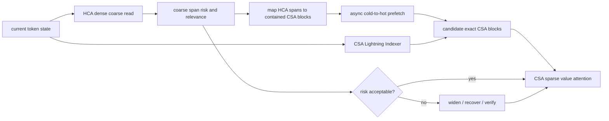

# Research landscape and next bets for Adaptive V4 Memory

Snapshot: 2026-07-17 (Asia/Seoul)

Status: strategy and hypothesis document; no claim or protocol amendment

> **Superseded primary ranking (2026-07-17):** the later
> [`deep_research_swarm_2026-07-17.md`](deep_research_swarm_2026-07-17.md)
> red-team audit demotes HCA-guided physical prefetch to a trace-only hypothesis.
> Its current primary question is HCA--CSA conditional sufficiency and selective
> statistical-order acquisition against ECHO, prior-CSA reuse, COBS, and the
> exact native index path. Sections 1 and 4 below are retained as the hypothesis
> that motivated that audit, not the current recommendation.

This document goes beyond the bibliographic
[`paper_map_2026.md`](paper_map_2026.md). It asks which technical paths the
field is pursuing, which constraints each path actually removes, where each
path is likely to saturate, and which research bets remain plausible for
DeepSeek-V4. Quantitative statements are attributed to primary paper pages;
the opportunity assessment is our inference and must be falsified experimentally.

## 1. Executive thesis

The field is converging from isolated “KV compression” toward a **controlled
memory hierarchy**. A successful method must solve four coupled problems:

1. estimate the future value of memory rather than only its past attention;
2. preserve, reconstruct, or verify information when that estimate is wrong;
3. make decisions at a causally usable point in the forward pass; and
4. turn irregular logical sparsity into lower physical HBM, traffic, and tail
   latency.

No current path solves all four cleanly. Post-hoc eviction is deployable but
brittle. Learned sparse architectures have a higher ceiling but require model
adaptation. Hierarchical and verified memory can recover from mistakes, but
move the bottleneck to transfer, reconstruction, or verification. Serving
systems can realize gains, but cannot repair a semantically wrong policy.

For Adaptive V4, the strongest new opportunity is not another scalar quota
rule. It is to exploit V4's native **HCA/CSA multi-resolution structure**:
use the dense, heavily compressed HCA path as a same-token coarse memory
directory for exact CSA detail, then widen or recover under calibrated risk.

## 2. Paths the field is taking

The outlook labels are qualitative:

- **high**: credible path to a material frontier improvement;
- **medium**: useful but likely one component of a larger system;
- **low**: crowded or structurally limited as a standalone contribution.

| Path | Representative 2026 work | What it buys | Structural limit | Outlook for V4 |
| --- | --- | --- | --- | --- |
| attention/history-based eviction | [EntroKV](https://icml.cc/virtual/2026/poster/60679), [OBCache](https://icml.cc/virtual/2026/poster/62607), [CapKV](https://icml.cc/virtual/2026/poster/66558), [VaSE](https://arxiv.org/abs/2606.03928) | training-free or cheap importance scores | attention, entropy, geometry, and value magnitude remain proxies for future causal need | **low alone**, useful signal ablations |
| adaptive budget allocation | EntroKV, [LU-KV](https://icml.cc/virtual/2026/poster/65241), [RaBitQCache](https://icml.cc/virtual/2026/poster/60504), [Elastic Attention](https://arxiv.org/abs/2601.17367) | spends memory or computation where demand appears dense | irregular budgets create fragmentation, load imbalance, and controller cost | **medium**, only with a page/kernel contract |
| future-utility prediction | [ForesightKV](https://arxiv.org/abs/2602.03203), [SP-KV](https://arxiv.org/abs/2605.14037), [KVpop](https://arxiv.org/abs/2607.05061) | learns long-horizon value instead of extrapolating current attention | labels are expensive; delayed future context conflicts with same-token serving and shifts across tasks | **medium-high**, but crowded as generic learned eviction |
| hierarchical sparse indexing | [IndexCache](https://arxiv.org/abs/2603.12201), [HISA](https://arxiv.org/abs/2603.28458), [MISA](https://arxiv.org/abs/2605.07363), [DHSA](https://icml.cc/virtual/2026/poster/61654) | reduces the indexer's full-prefix scan and amortizes routing | coarse filtering can only save work if its candidate recall is extremely high and kernels exploit it | **high systems relevance**, limited standalone novelty |
| adaptive sparse attention | [DashAttention](https://arxiv.org/abs/2605.18753), [HiLS](https://arxiv.org/abs/2607.02980), RaBitQCache | variable cardinality and end-to-end learned routing | changes read compute but not necessarily logical or physical cache size | **medium**, complementary to residency |
| precision and low-rank representation | [GSRQ](https://icml.cc/virtual/2026/poster/65012), [STAR-KV](https://icml.cc/virtual/2026/poster/61958), [xKV](https://icml.cc/virtual/2026/poster/63436) | directly reduces bytes per retained entry | error accumulates over long generation; custom kernels and calibration are essential | **medium-high engineering**, crowded research axis |
| hierarchical recoverable memory | [IndexMem](https://arxiv.org/abs/2605.25475), [SeKV](https://arxiv.org/abs/2606.31145), [ZoomR](https://arxiv.org/abs/2604.10898), [EpiCache](https://icml.cc/virtual/2026/poster/65405) | summary-first retrieval with latent, low-rank, episodic, or exact detail | recovery may be approximate; transfer and zoom-in latency can erase the HBM gain | **high**, especially with V4's native hierarchy |
| exact/lossless recovery and verification | [KV-Direct](https://arxiv.org/abs/2603.19664), [FAFO](https://icml.cc/virtual/2026/poster/61985), [VeriCache](https://arxiv.org/abs/2605.17613), [runtime-certified attention](https://arxiv.org/abs/2605.20868) | bounds or eliminates output divergence | full-state verification/recovery is expensive; local attention guarantees do not imply task correctness | **high for reliability**, likely a fallback rather than the main fast path |
| serving and storage co-design | [Tangram](https://arxiv.org/abs/2606.06302), [AsymCache](https://arxiv.org/abs/2606.02964), [Tutti](https://arxiv.org/abs/2605.03375), [Vortex](https://arxiv.org/abs/2606.06453) | realizes ragged budgets, non-contiguous caches, SSD tiers, and programmable sparse kernels | a fast system faithfully accelerates a bad semantic decision too | **mandatory**, but insufficient alone |
| memory-native model training | [NOSA](https://arxiv.org/abs/2510.13602), SP-KV, Elastic Attention, [Key-Value Means](https://arxiv.org/abs/2605.09877), [stochastic depth-wise sharing](https://arxiv.org/abs/2604.22782) | teaches the model to write, route, share, or summarize memory predictably | requires continued pretraining or new checkpoints and weakens direct deployment claims | **highest long-term ceiling**, low near-term feasibility |
| semantic/structural memory units | EpiCache, [ShotKV/KVFundaBench](https://icml.cc/virtual/2026/poster/66656), [structural-role filtering](https://arxiv.org/abs/2607.13205), [ArborKV](https://icml.cc/virtual/2026/poster/63539) | protects episodes, examples, values, instructions, and search branches rather than isolated tokens | ontology and parser assumptions may not generalize; boundaries can be task-specific | **medium**, essential safety feature but weak standalone novelty |
| theory and risk certification | [minimax risk](https://arxiv.org/abs/2607.01520), runtime-certified attention, [CONF-KV](https://arxiv.org/abs/2605.24786) | says when compression is possible and when to widen or recover | worst-case bounds can be vacuous; empirical calibration breaks under shift | **high scientific upside**, still early |

## 3. What the recent results imply

### 3.1 Generic importance scoring is approaching diminishing returns

The score family is expanding—entropy, output perturbation, information
capacity, geometry, value magnitude, predictive uncertainty, and semantic
role—but these scores disagree because they estimate different notions of
importance. The July structural-role study shows why accumulated attention can
prefer delimiters or keys over answer-bearing values. OBCache and the output
perturbation line show that values and downstream outputs matter in addition to
attention mass. KVpop and ForesightKV show that future contribution differs
from instantaneous contribution.

The implication is not to search indefinitely for a universal scalar score.
The more plausible design is a **mixture of evidence with a recovery path**,
validated against causal output damage.

### 3.2 Dynamic allocation is useful only if the layout is designed for it

EntroKV, LU-KV, and adaptive top-p methods support non-uniform demand. Tangram
shows the opposing systems fact: ragged budgets can trap memory in fragmented
pages, require reclamation, and skew GPU work. A dynamic policy therefore has
to beat a strong calibrated static layout after controller, paging, and load
balancing costs. Logical token counts are not evidence.

### 3.3 Recoverability is replacing irreversible compression

IndexMem retains a latent residual, SeKV stores a coarse GPU summary and CPU
basis, EpiCache preserves episodes, FlashMemory retains a cold V4 pool, and
KV-Direct reconstructs from residual checkpoints. VeriCache and FAFO go one
step further and use a compressed path only as a proposal that is verified by
an exact path. This is a deeper shift: the main design variable is becoming
**recovery cost**, not simply retention ratio.

### 3.4 Model training is moving toward compressibility

SP-KV learns whether to write, NOSA trains transfer locality, Elastic Attention
learns computation modes, and stochastic depth-wise sharing trains robustness
to missing per-layer caches. These methods suggest that post-hoc compression
may eventually lose to models trained with an explicit memory contract. This
route has the highest ceiling, but it cannot be the primary near-term Adaptive
V4 claim without trainable official-scale resources.

### 3.5 Worst-case safety is becoming a primary research axis

KVFundaBench finds retrieval success can hide high-density reasoning failure;
VeriCache reports growing divergence on long code/tool generation; the minimax
risk work formalizes workloads that are intrinsically hard to compress. Average
LongBench or NIAH accuracy can no longer justify a general quality claim.

## 4. The central opportunity: HCA-guided same-token CSA recovery

### 4.1 Why V4 creates a distinct opening

V4 already contains two resolutions of long-range memory:

- HCA densely reads highly compressed global spans;
- CSA retains finer compressed blocks and uses the Lightning Indexer for sparse
  detail selection.

With default rates, one 128-token HCA span corresponds to roughly 32 four-token
CSA entries, with boundary details determined by the compressor layout. Where
an HCA layer is causally available before a later CSA layer at the
same token, its already-computed global signal can identify coarse regions
before the CSA value read. The latest preceding HCA signal can therefore serve
as an **in-model memory directory**, rather than adding an external semantic
summary encoder.

A targeted literature search found close ingredients—SeKV summary-to-detail
zoom-in, FlashMemory lookahead, HISA hierarchy, and NOSA transfer locality—but
not a direct study of an existing V4 HCA path routing exact cold CSA detail.
That is an opportunity signal, not proof of novelty.

### 4.2 Candidate mechanism

The first CSA layer without a causally prior HCA signal uses the native or
calibrated fixed path. Later CSA layers combine:

1. HCA coarse-region mass or output contribution;
2. native Lightning Indexer rank within those regions;
3. temporal reuse and protected semantic units; and
4. a risk rule that widens, transfers exact blocks, or verifies.

Prefetch begins as soon as the HCA signal is produced and may overlap with the
remaining HCA block, MLP/MoE work, and intervening layers. The overlap window
may be too short; this is a primary systems hypothesis, not an assumption.

### 4.3 Why it may beat the current controller

The M5 pilot failed because a global decision becomes available only after all
CSA layers finish, so it applies the previous token's ranking to a new query.
The same-token pilot repaired the causality failure but collapsed to the fixed
policy because it had no new predictive signal strong enough to reallocate a
tight quota. A causally earlier HCA path could supply genuinely new same-token
global evidence without waiting for future CSA layers.

### 4.4 Fast falsification gates

| Gate | Test | Continue only if |
| --- | --- | --- |
| H0 signal | map each HCA span to later CSA oracle-needed blocks on frozen native traces | HCA features improve held-out oracle block recall or sufficient-budget prediction over previous-token and prior-CSA features across both scales |
| H1 causality | same-token HCA-guided candidate selection, no physical transfer | quality–block frontier improves over fixed+pins and calibrated+pins without using future-layer information |
| H2 movement | exact cold CSA blocks with asynchronous promotion | useful-transfer fraction rises and late misses fall at matched hot HBM; transfer is not merely shifted earlier |
| H3 systems | paged/fused prototype over context/batch/concurrency matrix | total HBM and p95 latency improve after index, rollback, and controller state are counted |
| H4 transfer | query shift, dense reasoning, multi-turn, and natural suites | gain is not confined to synthetic sparse retrieval or one checkpoint family |

Failure at H0 should stop this direction before a runtime implementation.

## 5. Second bet: calibrated risk sets instead of heuristic fallback

The current fallback uses thresholds over uncertainty and score density. Recent
work suggests a stronger formulation: choose the smallest active set for which
the estimated probability of causal damage stays below a target.

Let `E(k)` be an event that a `k`-block decision exceeds a frozen error
tolerance relative to native execution. On disjoint calibration conversations,
fit a nonconformity score using HCA/CSA disagreement, omitted score mass,
boundary margin, value norms, structural roles, and query shift. A grouped
split-conformal rule can then choose the smallest `k` whose calibrated upper
risk is acceptable; otherwise it widens to native or exact recovery.

This would target **marginal statistical coverage within the declared
calibration regime**, not conditional coverage or deterministic correctness.
Sequential tokens are dependent and workload shift breaks ordinary
exchangeability, so calibration must be grouped by conversation/checkpoint and
reported as risk–coverage curves with an OOD fallback. Runtime-certified
quantized attention is the closest proof that local error bounds can drive a
tiered fallback, but sparse omission and end-task risk remain different
problems.

Fast falsification:

1. define causal error labels before fitting the score;
2. calibrate on whole conversations and seeds, never individual shuffled tokens;
3. test empirical violation rates on every frozen workload family and worst
   slice;
4. compare against fixed, uncalibrated uncertainty, minimax-inspired, and
   always-native policies at the same risk target; and
5. reject the claim if coverage fails under the declared in-scope distribution
   or if fallback destroys the memory frontier.

## 6. Third bet: future option value for recoverable memory

Current methods usually estimate immediate relevance or future attention. A
recoverable tier changes the objective. A cold block can be absent now yet
still valuable if it is likely to be needed before the system can recover it.
The decision should therefore estimate an **option value**:

\[
V_{i,t} = P(T_i \leq H \mid x_t) C_{miss,i}
          + R_{quality,i}
          - \lambda_{HBM} B_i
          - \lambda_{IO} E[D_i],
\]

where `T_i` is time to next critical use, `C_miss` includes late-transfer or
recompute cost, `R_quality` is causal damage if recovery misses its deadline,
`B_i` is resident bytes, and `D_i` is expected movement.

A survival/hazard model can learn time-to-next-critical-use from native traces.
This differs from KVpop/ForesightKV by explicitly modeling the recovery deadline
and hardware cost, but it is vulnerable to query shift and expensive labels.
It should remain exploratory until a cheap oracle trace study shows better
movement–quality trade-offs than future-attention-only, recency, and current
relevance policies.

## 7. Fourth bet: a hardware-priced recovery market

The available actions are no longer binary keep/drop. For each block the system
may:

1. keep exact CSA state in HBM;
2. transfer exact or quantized state from host/SSD;
3. reconstruct from a latent or residual checkpoint;
4. rely on the dense HCA summary; or
5. run a compressed draft and verify later.

Each request can expose a marginal quality-utility curve, while the scheduler
maintains online prices for HBM, interconnect bandwidth, index compute, and SLO
slack. Low load permits wider exact memory; high load raises the resource price
and chooses cheaper representations. This connects semantic memory control to
Tangram/AsymCache/Tutti-style serving realities.

The path has high systems impact but also the largest implementation surface.
It should follow, not precede, evidence that HCA-guided utility or calibrated
risk predicts causal need. Otherwise it only optimizes movement of the wrong
blocks.

## 8. Fifth bet: train HCA to be a memory directory

If frozen HCA signals are directionally useful but insufficient, add a small
cross-path head or auxiliary distillation objective:

- teacher target: later CSA oracle selections or causal output damage;
- student input: current HCA query, coarse entries, layer and phase state;
- output: coarse regions, required detail budget, and risk;
- deployment: frozen backbone plus a small HCA-side router.

This is more specific than generic SP-KV admission or a separate FlashMemory
indexer: it trains one native attention path to route another. It also avoids
changing the primary V4 representation if a side adapter suffices. The downside
is checkpoint dependence and the lack of official-scale training resources.
Tier-S can establish the mechanism, but cannot support a production V4 claim.

## 9. Portfolio decision

| Bet | Scientific novelty | Near-term feasibility | Systems impact | Main threat | Recommendation |
| --- | --- | --- | --- | --- | --- |
| HCA-guided same-token CSA recovery | high if direct prior remains absent | high for trace test, medium for runtime | high | HCA and CSA needs may be weakly correlated | **primary new direction** |
| calibrated risk sets | medium-high | medium | high for tail safety | sequential/shifted data invalidates calibration | **co-primary analysis track** |
| future option value | medium | medium-high offline | medium-high | labels and future shift | **cheap exploratory trace study** |
| hardware-priced recovery market | medium-high systems | low-medium | very high | implementation before semantic proof | **defer until signal gate passes** |
| HCA cross-path distillation | high | medium on Tier-S, low official-scale | high long-term | requires adaptation and resources | **long-term branch** |
| generic new eviction score | low | high | low-medium | saturated field and proxy brittleness | **do not make headline** |
| generic adaptive quantization | low-medium | medium | high | crowded and kernel-heavy | **orthogonal comparator, not core** |
| semantic pin rules | low alone | high | medium safety value | task-specific ontology | **retain as control/safety feature** |
| full lossless verification | low as novelty | medium | high in code/tool workloads | swap/verification overhead | **strong fallback baseline** |

## 10. Relationship to the active empirical program

The running P2 core and causal factorial stay unchanged. They answer the frozen
question of whether calibrated same-token quotas and pins beat a matched fixed
policy. Changing their signals now would invalidate the preregistration.

The new portfolio begins as a separate post-freeze sequence:

1. finish and audit P2 exactly as frozen;
2. add an HCA trace-only probe that does not affect P2 execution or outcomes;
3. run the H0 correlation/prediction gate on disjoint traces;
4. only if H0 passes, freeze a new HCA-guided causal pilot and risk-calibration
   protocol;
5. keep P3 natural and P4 system evidence as external validity gates; and
6. compare against FlashMemory, IndexCache/MISA, SeKV/IndexMem, VeriCache/FAFO,
   and Tangram/AsymCache according to architecture and code compatibility.

This creates a clean decision. If P2 is positive, HCA guidance can explain and
extend the adaptive mechanism. If P2 is negative but H0 passes, the new signal
is a principled pivot rather than post-hoc tuning of the failed arm. If both
fail, the project should narrow to the validated fixed tiered-memory result and
the broader benchmark/system contribution rather than invent another score.
